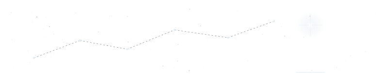

<div align="center">
  
</div>

<h1 align="center"><span style="color:#e6edf3; letter-spacing:0.28em;">sirius</span></h1>

<p align="center">
  
</p>

<div align="center">
  
</div>

<p>
  <strong>salut👋🏽</strong> je fais du <strong>Python</strong>, de l'<strong>intelligence artificielle</strong>, du machine learning classique au deep learning avec TensorFlow. Mais un modèle ne vaut rien s'il n'est pas déployé : je développe aussi des applications <strong>mobiles en Dart / Flutter</strong>, et je touche au <strong>web</strong> quand le projet l'exige.
</p>

<div align="center">
  
</div>

<h3><span style="color:#e6edf3;"> bio </span> <span style="color:#9aa4b2;">. me</span></h3>

```python
#!/usr/bin/python
# -*- coding: utf-8 -*-

class WhoAMI:
    user     = "Papa"
    role     = "Computer scientist, Ingénieur logiciel & développeur IA"
    parcours = ["Génie logiciel", "CS50x&p . Harvard en Python et Computer Science"]
    stack    = ["Python", "TensorFlow", "scikit-learn", "pandas", "numpy", "matplotlib"]
    mobile   = ["Dart", "Flutter"]
    web      = ["HTML", "CSS", "JavaScript"]
    statut   = "Equipe, freelance & collab"
    hors_code = [
      "Foot"; 
      "Science"; 
      "Art", 
      "Mangas", 
      "Fiction", 
      "Ecriture"]

    def getcity(self):
      return "Dakar, Sénégal"

    def mission(self):
        return "Comprendre le besoin, structurer, livrer proprement."

    def humain(self):
        # derrière la machine, il y a un humain
        return "curieux, méthodique et créatif 🪟"

    def word(self):
        print("merci d'être passé et bonne visite par ici")
```

<div align="center">
  
</div>

<h3><span style="color:#9aa4b2;">Map</span> <span style="color:#e6edf3;">. de NumPy au deep learning</span></h3>

<p><span style="color:#8b949e;">Six ateliers pratiques, construits dans l'ordre. Le compteur de parcours se remplit à chaque étape.</span></p>

| n° | atelier | on y travaille | parcours |
|:---:|---|---|:---:|
| **01** | [`atelier_numpy_iot`](https://github.com/sirius-code7/atelier_numpy_iot) | calcul scientifique et tableaux avec NumPy | ▓░░░░░ |
| **02** | [`atelier_pandas_iot`](https://github.com/sirius-code7/atelier_pandas_iot) | manipulation et nettoyage des données | ▓▓░░░░ |
| **03** | [`atelier_matplotlib_iot`](https://github.com/sirius-code7/atelier_matplotlib_iot) | visualisation, premiers graphiques | ▓▓▓░░░ |
| **04** | [`atelier_seaborn_iot`](https://github.com/sirius-code7/atelier_seaborn_iot) | visualisation statistique avancée | ▓▓▓▓░░ |
| **05** | [`atelier_scikit-learn_iot`](https://github.com/sirius-code7/atelier_scikit-learn_iot) | régression, classification, évaluation | ▓▓▓▓▓░ |
| **06** | [`atelier_tensorflow_iot`](https://github.com/sirius-code7/atelier_tensorflow_iot) | réseaux de neurones, deep learning | ▓▓▓▓▓▓ |

<div align="center">
  
</div>

<h3><span style="color:#e6edf3;">Chantiers</span> <span style="color:#9aa4b2;">. projets concrets</span></h3>

| ⬡ | projet | domaine | description |
|:---:|---|---|---|
| **IA & données** | | | |
| ◆ | [`AI-Workspace`](https://github.com/sirius-code7/AI-Workspace) | IA | espace de travail et d'expérimentation |
| ◆ | [`ai-business_assistant`](https://github.com/sirius-code7/ai-business_assistant) | IA | assistant intelligent pour l'automatisation |
| ◆ | [`datasetManager`](https://github.com/sirius-code7/datasetManager) | données | gestion et préparation de jeux de données |
| **Mobile & système** | | | |
| ◇ | [`Portail-Patient`](https://github.com/sirius-code7/Portail-Patient) | mobile | application de suivi patient — Dart / Flutter |
| ◇ | [`atelier-linux-p1-ia`](https://github.com/sirius-code7/atelier-linux-p1-ia) | système | environnement Linux et fondations pour l'IA |

<div align="center">
  
</div>

<h3><span style="color:#9aa4b2;">Arsenal</span> <span style="color:#e6edf3;">. outils</span></h3>

<p>
  
  
  
  
  <br/>
  
  
  
  
  
  
    
  
  
</p>

<div align="center">
  
</div>

<h3><span style="color:#e6edf3;">Stats</span> <span style="color:#9aa4b2;">. a propos</span></h3>

<table align="center">
<tr>
<td>
<div align="center" style="background:#0d1117; border:1px solid #30363d; border-radius:8px; padding:18px 30px;">
<h3 align="left"><span style="color:#58a6ff;">Stats</span></h3>
<table>
<tr><td><span style="color:#8b949e;">Dépôts publics :</span></td><td align="right"><span style="color:#e6edf3;"><b>15</b></span></td></tr>
<tr><td><span style="color:#8b949e;">Sur GitHub depuis :</span></td><td align="right"><span style="color:#e6edf3;"><b>déc. 2024</b></span></td></tr>
<tr><td><span style="color:#8b949e;">Issues ouvertes :</span></td><td align="right"><span style="color:#e6edf3;"><b>1</b></span></td></tr>
</table>
</div>
</td>
<td>

</td>
</tr>
</table>

<div align="center">
  
</div>

<h3><span style="color:#e6edf3;">Trajectoire</span> <span style="color:#9aa4b2;">. ça continue</span></h3>

<p align="center">
  
</p>

<p align="center">
  
  
</p>

<div align="center">
  
</div>

<p align="center">
  <span style="color:#8b949e;">la simplicité est l'ultime sophistication</span><br/>
  <span style="color:#e6edf3;">Leonard de Vinci ⬡</span>
</p>

<p align="center">
  
</p>

<h3 align="center"><span style="color:#e6edf3;"></span><span style="color:#9aa4b2;">🥍🥅</span></h3>

<p align="center">
  <a href="https://ko-fi.com/siriuscode7">
    
  </a>
</p>

<p align="center">

</p>

